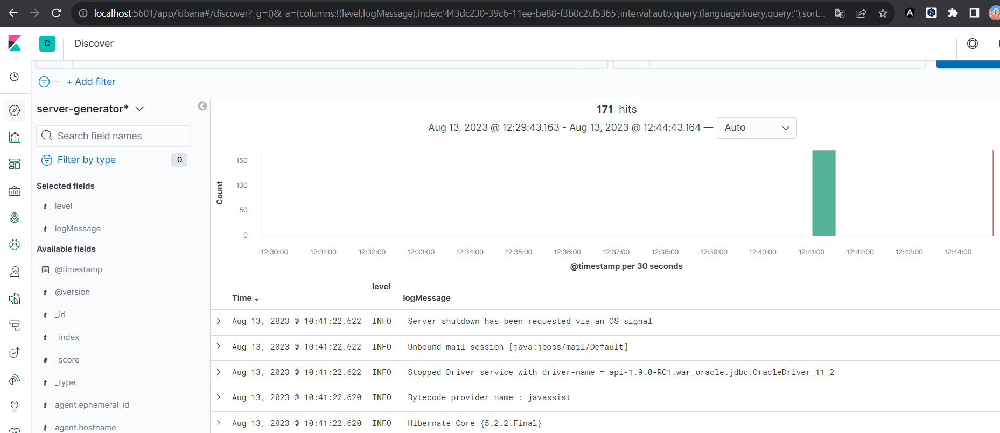

\
\
__Author:__ ***José Gregorio López***\
__Email:__ ***lopezajoseg@gmail.com***

## Dockerize Elasticsearch read log files from wildfly
Dockerizar elasticsearch, filebeat, kibana, logstash

## Configuration files

- Elasticsearch ruta: ./elasticseach/config
- Logstash ruta: ./logstash/settings/
- Filebeat ruta: ./filebeat-docker/

## Path files wildfly
 - In docker-compose.yml file go to the filebeat volumes section, and modify the path with the path where the logs are located.log example: ```- patch-local:/usr/share/filebeat/log-generatorg```

## Create and run the container 

```docker compose up -d```


## Stop y delete container 

```docker compose down```


## Kibana 
- Nota: wait a few minutes while all services are loaded.
- Enter in the following url manage de Kibana
[localhost:5601](http://localhost:5601/)


